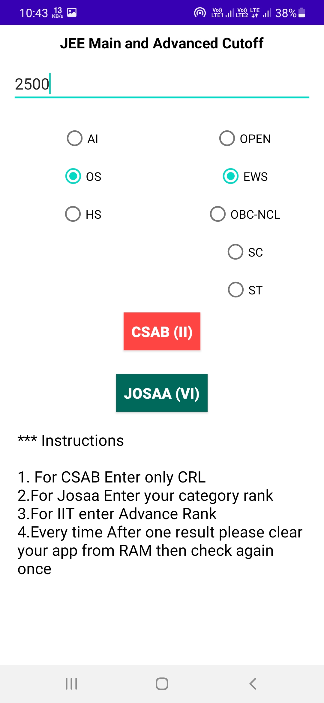
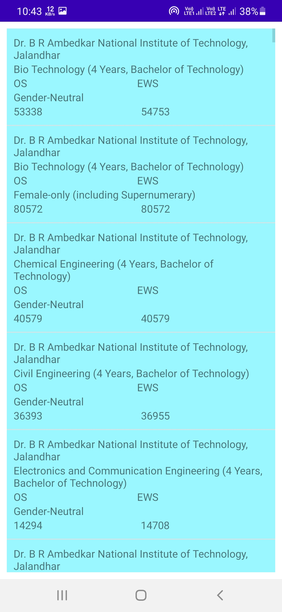

# JEE Main and Advanced Past Year Official Cutoff Check
JEE Main and Advanced cutoff check application 📱 built using Java ♨️ and showing best practices of 🛠️ API

# ⚙️ Features 
1. Enter your Rank and Caste and Domicile
2. Find all the College available for you
3. You can see every parameter

# Download the Apk

Download Apk 

 

## ⚙️ Technology Used

  </a>  <a href="https://www.java.com" target="_blank">  

## 📸 Screenshots

||||
|:----------------------------------------:|:-----------------------------------------:|:-----------------------------------------: |
|  |  |  |

## 📸 Video

Soon Arrive...
  
  <h2 align="center">📝 Created by </h2>

<h3>Amit maity</h3>

  
 
  
  
  
   
