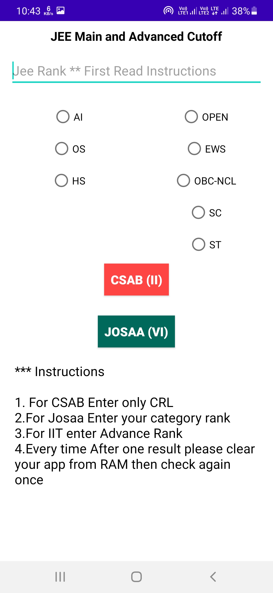

# JEE Main and Advanced Past Year Official Cutoff Check
JEE Main and Advanced cutoff check application 📱 built using Java ♨️ and showing best practices of 🛠️ API

# ⚙️ Features 
1. Enter your Rank and Caste and Domicile
2. Find all the College available for you
3. You can see every parameter

# Download the Apk

Get Apk [Download here](https://drive.google.com/file/d/1kkgs7mT-mAAJ7DQxa7eJ-98J0oQBWRee/view?usp=sharing)

## 📸 Screenshots

||||
|:----------------------------------------:|:-----------------------------------------:|:-----------------------------------------: |
|  |  |  |

## 📸 Video

Soon Arrive...
